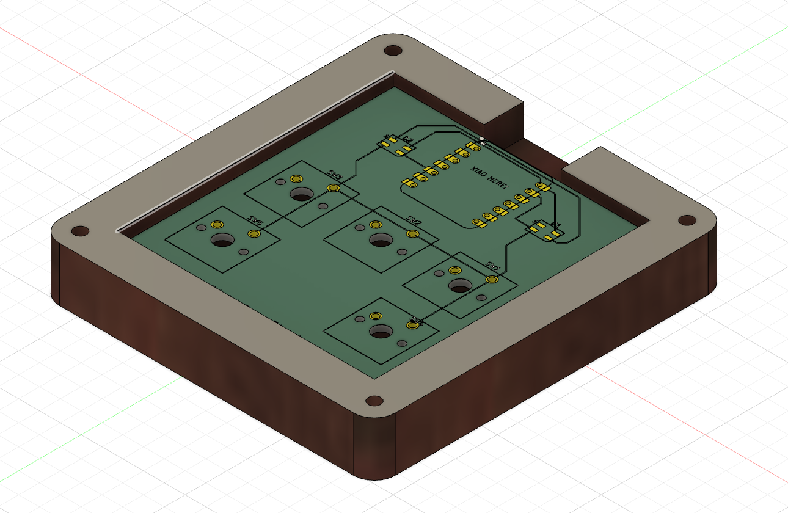

# ✨ Natasha’s Sensory Fidget Macropad

A 5-key tactile RGB macropad built with the Seeed Studio XIAO RP2040. This project is designed for sensory feedback, creative expression, and workflow speed — featuring bright colored LEDs that change with each keypress.

---

## an overview

_This shows the full layout of the macropad, including keys, controller, and LED placement._

---

## schematic

_The schematic shows the wiring of 5 pushbuttons to GPIO pins and two SK6812MINI RGB LEDs controlled via a single data line._

---

## PCB layout:

_The custom PCB was designed in KiCad. Buttons are routed directly to GPIOs, and the SK6812MINI LEDs are positioned symmetrically for visual balance._

---

## case design & assembly

_This image shows how the case pieces fit together. The design supports top plate mounting for the buttons and a cutout for USB access to the XIAO RP2040._

- **Top Plate:** Holds all 5 switches in place
- **Bottom Plate:** Secures the PCB from underneath
- **Standoffs/Screws:** Keep both plates sandwiched

---

## Bill of Materials (BOM)

| Qty | Component              | Description                             | Part/Link                        |
|-----|------------------------|-----------------------------------------|----------------------------------|
| 1   | XIAO RP2040            | Microcontroller (tiny + USB-C)          | [Seeed XIAO RP2040](https://www.seeedstudio.com/XIAO-RP2040-v1-0-p-5026.html) |
| 5   | Tactile Switches       | Mechanical push buttons (through-hole)  | [e.g., MX-compatible or 6mm tact] |
| 2   | SK6812MINI LEDs        | Addressable RGB LED (WS2812-compatible) | [SK6812MINI](https://www.adafruit.com/product/3484) |
| 1   | PCB                    | Custom PCB for layout                   | _Generated via KiCad_           |
| 1   | Case (3D-printed)      | Top and bottom shell                    | _Printed or laser-cut acrylic_  |
| 5   | Resistors (optional)   | Pull-up resistors (not needed with KMK) | _Usually 10kΩ, optional_        |
| -   | Screws/Standoffs       | M2 or M3 depending on hole size         | _To secure case_                |

---

## features of this pad:
- reactive RGB LEDs (each key sets a unique color) - pink, orange, turquoise, green, or purple!
- 5 dedicated macros (copy, paste, cut, undo, redo)
- open-source firmware using KMK (CircuitPython)

---

## ways to customize:

- modify the colors or key actions in `code.py`
- add extra LEDs or an encoder
- create a different case design in Fusion 360

---

## credits + license:

Designed with fun & exhaustion! This took me multiple days to get working as it was my first time working with hardware~ Glad I tried and learned!

