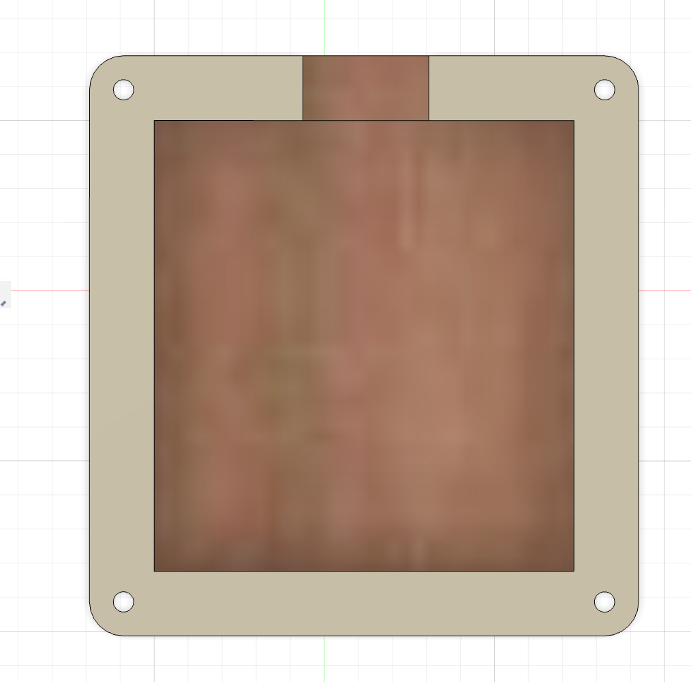

# Natasha’s Sensory Fidget Macropad!

Here's my project: a 5-key fidget hackpad based off the starter project offered on highway. It was created as a way to learn to use Kicad and design hardware. Inside, there is a XIAO RP2040 microcontroller, 2 RGB LEDs whose colors can changes, and can be used as a stress/anxiety/boredom reliever or for functional keyboard shortcuts. The case is made of 2 parts: a bottom and a top.

This was my very first time using Kicad and designing a PCB, which was actually very fun! My friends and I go to artisan pop up markets in my hometown often, and I always see keypad fidget toys, so when I saw the beginner friendly project was a hackpad, I knew I had to attempt it!

---
## full 3D model of my project:

---

## schematic

---

## PCB layout:

---

## case design & assembly

---

## Bill of Materials (BOM)

- (1) XIAO PR2040 Microcontroller - https://www.seeedstudio.com/XIAO-RP2040-v1-0-p-5026.html
- (5) Tactile Switches 
- (2) SK6812MINI LEDs  - https://www.adafruit.com/product/3484 
- (1) PCB
- (4) Screws (securing the case)
 The case is 3D printed (top and bottom)

---

## other:
- this hackpad (and the code in git) is controlled by Python code (Circuit Python)

- Designed with fun & exhaustion! This took me multiple days to get working as it was my first time working with hardware~ Glad I tried and learned!

